# 概要

## ソースコード

```html
<!DOCTYPE html>
<html>
  <head>
    <meta charset="UTF-8">
    <title>15puzzle</title>
    <style>
      .tile {
        width: 70px;
        height: 70px;
        border: 1px solid blue;
        border-radius: 10px;
        text-align: center;
        font-size: 36px;
        background-color: white;
        box-shadow: rgb(128, 128, 128) 5px 5px;
      }
    </style>
    <script>
      "use strict";

      const tiles = []; // タイル配列

      function init() {
        let table = document.getElementById("table"); // <table>要素の参照

        for (let i = 0; i < 4; i++) {
          // 4行分ループ
          let tr = document.createElement("tr"); // <tr>要素の作成
          for (let j = 0; j < 4; j++) {
            // 各列分ループ
            let td = document.createElement("td"); // <td>要素の作成
            let index = i * 4 + j;
            td.className = "tile"; // class設定
            td.index = index; // タイルの並び順
            td.value = index; // 描画されている値
            td.textContent = index == 0 ? "" : index; // 0は空欄に
            td.onclick = click; // クリック時のハンドラ登録
            tr.appendChild(td); // 行<tr>に列<td>を追加
            tiles.push(td);
          }
          table.appendChild(tr); // テーブルに行<tr>を追加
        }

        for (let i = 0; i < 1000; i++) {
          // 1000回、疑似的にランダムにクリックして並べ替え
          click({ target: { index: Math.floor(Math.random() * 16) } });
        }
      }

      function click(e) {
        let i = e.target.index; // どの場所がクリックされたか

        if (i - 4 >= 0 && tiles[i - 4].value == 0) {
          swap(i, i - 4); // 上と入れ替え
        } else if (i + 4 < 16 && tiles[i + 4].value == 0) {
          swap(i, i + 4); // 下と入れ替え
        } else if (i % 4 != 0 && tiles[i - 1].value == 0) {
          swap(i, i - 1); // 左と入れ替え
        } else if (i % 4 != 3 && tiles[i + 1].value == 0) {
          swap(i, i + 1); // 右と入れ替え
        }
      }

      // i番目のタイルとj番目のタイルの番号を入れ替え
      function swap(i, j) {
        let tmp = tiles[i].value; // 変更先を一時退避
        tiles[i].textContent = tiles[j].textContent;
        tiles[i].value = tiles[j].value;
        tiles[j].textContent = tmp;
        tiles[j].value = tmp;
      }

    </script>
  </head>
  <body onload="init()">
    <table id="table"></table>
  </body>
</html>

```

## ソースコード解説

### 1. use strict

`"use strict";`を記述しておくと、より厳密にエラーチェックが行われる。

### 2. init()

1. 初期化処理
1. `<table>`要素への参照を取得

    ```javascript
    let table = document.getElementById("table");
    ```

1. 行は`<tr>`要素で、その中のタイルは`<td>`要素で実装している  
   外側のfor文を4回繰り返すことで、4行作成している。  
   各行は、`let tr = document.createElement("tr");`で作成している。  
   1行作成するたびに、内側のfor文でタイルを4つ作成している。  
   各タイルは`let td = document.createElement("td");`で作成  
   `table.appendChild(tr);`で行に挿入している。  
   要は4x4の盤面をJavaScriptから作成している。  

    ```javascript
        for (let i = 0; i < 4; i++) {
          // 4行分ループ
          let tr = document.createElement("tr"); // <tr>要素の作成
          for (let j = 0; j < 4; j++) {
            // 各列分ループ
            let td = document.createElement("td"); // <td>要素の作成
            let index = i * 4 + j;
            td.className = "tile"; // class設定
            td.index = index; // タイルの並び順
            td.value = index; // 描画されている値
            td.textContent = index == 0 ? "" : index; // 0は空欄に
            td.onclick = click; // クリック時のハンドラ登録
            tr.appendChild(td); // 行<tr>に列<td>を追加
            tiles.push(td);
          }
          table.appendChild(tr); // テーブルに行<tr>を追加
        }
    ```

### 3. タイルについて

indexはタイルの並び順で、valueはタイルに描画されている数値です。



タイルがクリックされると、`click(e)`が呼びされる。  
そのタイルの上下左右のどこかに空タイル(valueプロパティが0のタイル)があった場合、それらタイルのvalueを入れ替える。  
そのためには、クリックされたタイルの上下左右を調べる必要がある。  

クリックしたタイルのindexは`let i = e.target.index;`の`e.target.index`で取得できる。  
よって、上のタイルは`index-4`、下のタイルは`index+4`、左のタイルは`index-1`、右のタイルは`index+1`で求めることができる。


ただし、値を比較する際には若干の注意が必要。  
たとえば、最上段がクリックされた場合、その上に行はないので比較できない。逆に最下段がクリックされた場合、その下に行はない。  
これらの処理は、すべて`click(e)`の中で行われている。  

```javascript
function click(e) {
  let i = e.target.index; // どの場所がクリックされたか
  if (i - 4 >= 0 && tiles[i - 4].value == 0) {
    swap(i, i - 4); // 上と入れ替え
  } else if (i + 4 < 16 && tiles[i + 4].value == 0) {
    swap(i, i + 4); // 下と入れ替え
  } else if (i % 4 != 0 && tiles[i - 1].value == 0) {
    swap(i, i - 1); // 左と入れ替え
  } else if (i % 4 != 3 && tiles[i + 1].value == 0) {
    swap(i, i + 1); // 右と入れ替え
  }
}
```

`index-4`が0以上であるかを最初にチェックし、それがtrueの場合、すなわち上にタイルが存在する場合に限り、`tiles[i - 4].value`の値が0か比較している。  
4つのif文は上下左右の比較を行っているので見比べてみるとその意図がわかる。条件式が成立した場合は`swap(i, j)`を呼び出してタイルの番号を入れ替えている。textContent(画面表示用)とvalue(内部管理用)のプロパティを入れ替えていることに注意が必要。  

以下の行はタイルがランダムに1000回クリックされた状況を再現している。  

```javascript

for (let i = 0; i < 1000; i++) {

// 1000回、疑似的にランダムにクリックして並べ替え
  click({ target: { index: Math.floor(Math.random
  () * 16) } });
}
```

クリックされたときに`click(e)`が呼び出されるが、`click(e)`の中では`e.target.index`でインデックスを取得している。その関数に合わせて引数を作成している。`click(e)`を流用せずに別途処理を記述してもよかったが、全体の行数を削減するためにこのような実装とした。
